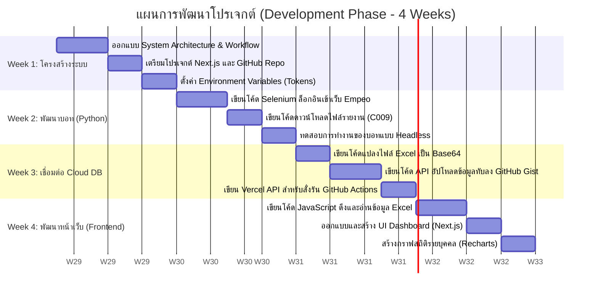

# Empeo Dashboard - 4 Weeks Development Plan

```mermaid
gantt
    title แผนการพัฒนาโปรเจกต์ (Development Phase - 4 Weeks)
    dateFormat  YYYY-MM-DD
    axisFormat  W%W
    
    section Week 1: โครงสร้างระบบ
    ออกแบบ System Architecture & Workflow     :a1, 2026-07-20, 3d
    เตรียมโปรเจกต์ Next.js และ GitHub Repo    :a2, after a1, 2d
    ตั้งค่า Environment Variables (Tokens)     :a3, after a2, 2d
    
    section Week 2: พัฒนาบอท (Python)
    เขียนโค้ด Selenium ล็อกอินเข้าเว็บ Empeo     :b1, 2026-07-27, 3d
    เขียนโค้ดดาวน์โหลดไฟล์รายงาน (C009)        :b2, after b1, 2d
    ทดสอบการทำงานของบอทแบบ Headless         :b3, after b2, 2d
    
    section Week 3: เชื่อมต่อ Cloud DB
    เขียนโค้ดแปลงไฟล์ Excel เป็น Base64         :c1, 2026-08-03, 2d
    เขียนโค้ด API อัปโหลดข้อมูลทับลง GitHub Gist :c2, after c1, 3d
    เขียน Vercel API สำหรับสั่งรัน GitHub Actions:c3, after c2, 2d
    
    section Week 4: พัฒนาหน้าเว็บ (Frontend)
    เขียนโค้ด JavaScript ดึงและอ่านข้อมูล Excel   :d1, 2026-08-10, 3d
    ออกแบบและสร้าง UI Dashboard (Next.js)     :d2, after d1, 2d
    สร้างกราฟสถิติรายบุคคล (Recharts)         :d3, after d2, 2d
```
