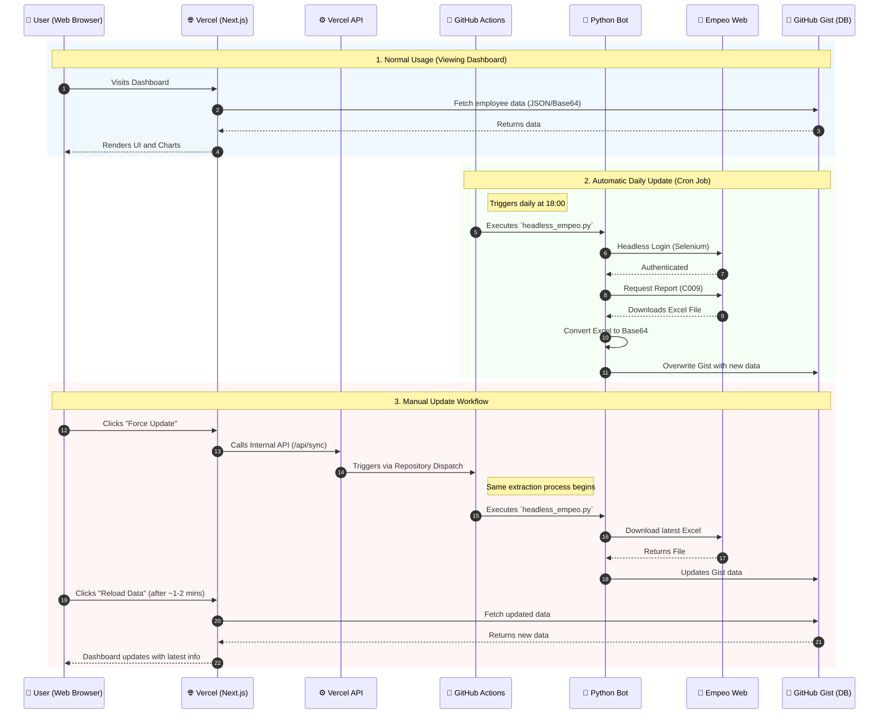

# Empeo Dashboard - System Workflow Diagram

This document illustrates the complete automated workflow of the Empeo Attendance Dashboard.

## Architecture Flow

## Description of Components:
- **Vercel (Next.js):** The frontend that users interact with. It directly pulls data from GitHub Gist to display charts.
- **Vercel API:** A serverless function inside the Next.js app used as a bridge to trigger GitHub Actions securely.
- **GitHub Actions:** The cloud runner that acts as the server to execute the data extraction.
- **Python Bot (`headless_empeo.py`):** The selenium web scraper that logs into Empeo, bypassing the need for an official API.
- **GitHub Gist:** Acts as a lightweight, free NoSQL database storing the encoded Excel file.
