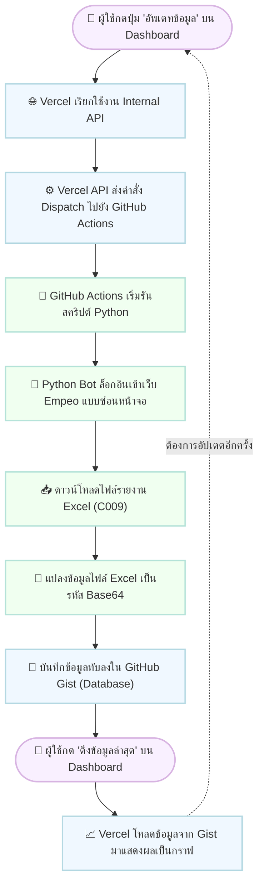

# Empeo Dashboard - System Workflow Diagram

```mermaid
graph TD
    A(["👤 ผู้ใช้กดปุ่ม 'อัพเดทข้อมูล' บน Dashboard"]) --> B["🌐 Vercel เรียกใช้งาน Internal API"]
    B --> C["⚙️ Vercel API ส่งคำสั่ง Dispatch ไปยัง GitHub Actions"]
    C --> D["🤖 GitHub Actions เริ่มรันสคริปต์ Python"]
    D --> E["🐍 Python Bot ล็อกอินเข้าเว็บ Empeo แบบซ่อนหน้าจอ"]
    E --> F["📥 ดาวน์โหลดไฟล์รายงาน Excel (C009)"]
    F --> G["🔄 แปลงข้อมูลไฟล์ Excel เป็นรหัส Base64"]
    G --> H["💾 บันทึกข้อมูลทับลงใน GitHub Gist (Database)"]
    H --> I(["👤 ผู้ใช้กด 'ดึงข้อมูลล่าสุด' บน Dashboard"])
    I --> J["📈 Vercel โหลดข้อมูลจาก Gist มาแสดงผลเป็นกราฟ"]
    
    J -.->|"ต้องการอัปเดตอีกครั้ง"| A

    classDef userAction fill:#f9f0ff,stroke:#d8b4e2,stroke-width:2px;
    classDef systemAction fill:#f0f8ff,stroke:#b4d8e2,stroke-width:2px;
    classDef botAction fill:#f0fff0,stroke:#b4e2d8,stroke-width:2px;
    
    class A,I userAction;
    class B,C,H,J systemAction;
    class D,E,F,G botAction;
```
